# KabaleNU "Campus Connect"

An exclusive social platform for National University (NU) Clark students and faculty. Campus Connect brings a trending newsfeed, stories, campus events, a student marketplace, interest-based channels, friends, and direct messages into one place, with NU Blue and Gold branding.

Built for the CTADWEBL Final Project.

## Group Members

| Name | GitHub | Slice |
| ---- | ------ | ----- |
| Kaleb Cunanan | [@kalebcunanan](https://github.com/kalebcunanan) | System design, Express API, MongoDB database, authentication, and the React client built from Ivymary's designs |
| Ivymary David | [@david-ivy](https://github.com/david-ivy) | UI/UX design: the mockups the interface follows, and the design notes in `docs/design/` |
| John Paulo Pamintuan | [@asismedelpaulo-lab](https://github.com/asismedelpaulo-lab) | Code cleanup (relative time text and comment conventions) and testing of Login, Register, and Landing |
| Aizen Guevarra | [@guevarraaizen](https://github.com/guevarraaizen) | Theme configuration (shared colors), mobile testing, and screenshots |

## Concept

Students and faculty of NU Clark currently rely on scattered Facebook groups for announcements, buying and selling, and event sign-ups. Campus Connect replaces them with one verified space:

- **Faculty (admin)** post official events and moderate reported content.
- **Bulldogs (college students)** and **Bullpups (senior high students)** post, react, comment, share stories, buy and sell, register for events, join channels, add friends, and message each other.

## What Data Is Processed

| Processing | Description |
| ---------- | ----------- |
| Trending feed | A Hotness Score computed from Bulldog Reacts, comments, and post age: `(reacts + 2 * comments) / (ageInHours + 2) ^ 1.5`. |
| Event registration | Checks slot capacity, duplicate registration, and time-range conflicts with the user's other registrations. Slots are decreased atomically. |
| Marketplace search | Filters by keyword, category, status, and price range, sorts the results, and computes the average, lowest, and highest price of the results. |
| Status transition | Moves an item through Available, Reserved, and Sold with validated transitions. |
| Leaderboard | Ranks students by Bulldog Score earned from posts (+5), reacts received (+1), and event registrations (+10). |
| Auto-hide moderation | Hides a post once it reaches 5 reports (one report per user). |
| Friend privacy | A user's posts, score, and direct messages are visible only to accepted friends. |
| Story expiry | Stories expire 24 hours after creation; expired stories and their media are purged whenever stories are listed. |

## Tech Stack

- **Client:** React 19 (Vite), TypeScript, Tailwind CSS, React Router, React Hook Form, Zod, Axios
- **Server:** Node.js, Express 5, MongoDB Atlas, Mongoose, JWT in httpOnly cookies, bcryptjs, Multer
- **Media:** Cloudinary for profile pictures, post photos and videos, story media, marketplace photos, and event banners
- **Hosting:** Prepared for Vercel: the server exports its Express app so it can also run as a Vercel function, and its routes answer with and without the `/api` prefix

## Features

- [x] JWT authentication with httpOnly cookies and role-based access
- [x] Login and Register pages with Zod validation (two-step register with program selection)
- [x] Protected routes and session restore
- [x] Animated welcome transition after login and register
- [x] Profile pictures chosen during registration and changeable from the profile page
- [x] Trending newsfeed with a Recent and Trending toggle, comments, and Bulldog Reacts
- [x] Posts with up to 4 photos or videos
- [x] Stories (24 hours)
- [x] Campus events with banner images, registration with conflict checking, and a faculty registrant list
- [x] Marketplace with photo upload, multi-criteria search, Good Deal badges, and seller delete
- [x] Channels as group chats with join, leave, and member counts
- [x] Friends: search, requests, friends list, and locked public profiles
- [x] Direct messages in a chat dock (about a market item, or between friends)
- [x] Leaderboard
- [x] Content moderation
- [x] Skeleton loading, staggered fade-in, and toast feedback on every data screen

## Screenshots

### Landing
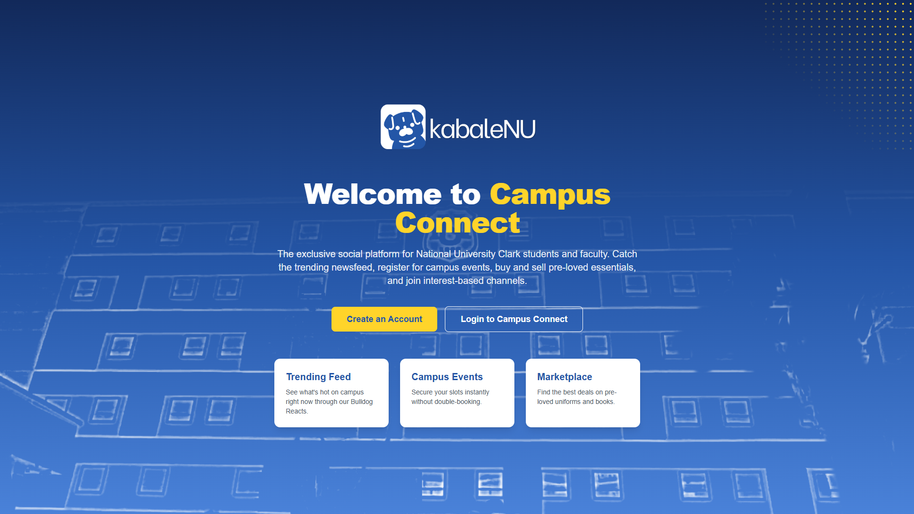

### Login
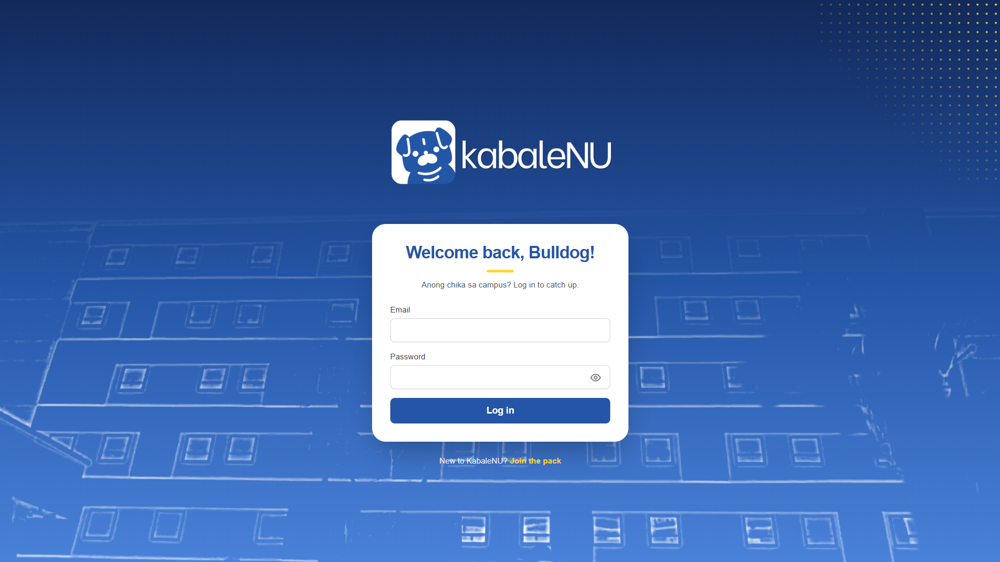

### Register
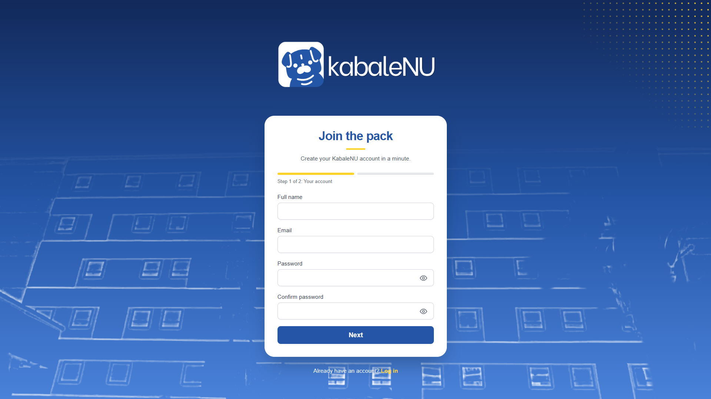

### Home
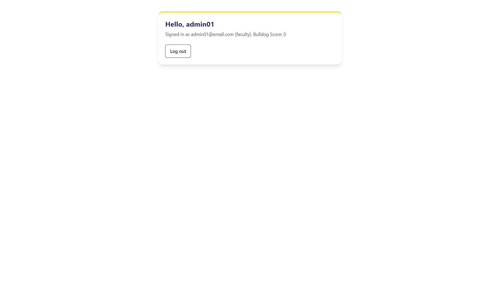

### Profile
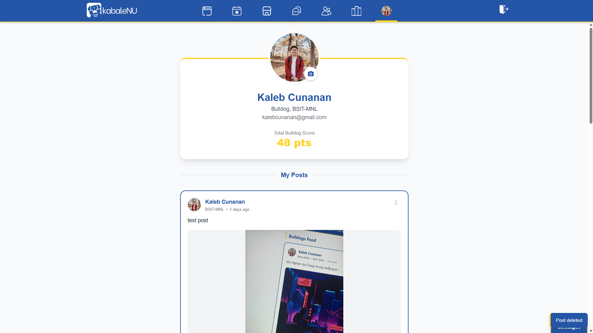

### Events
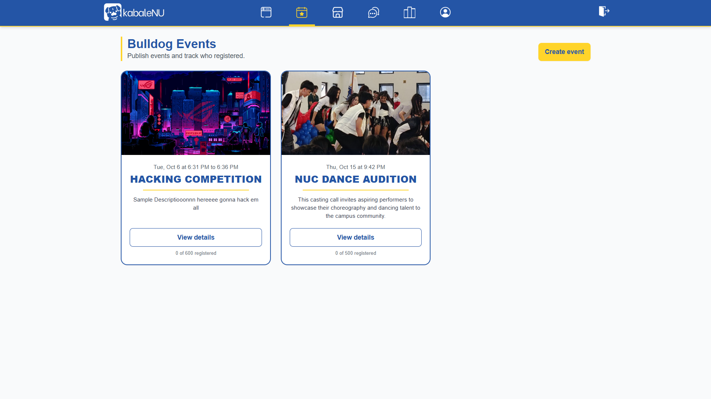

### Marketplace
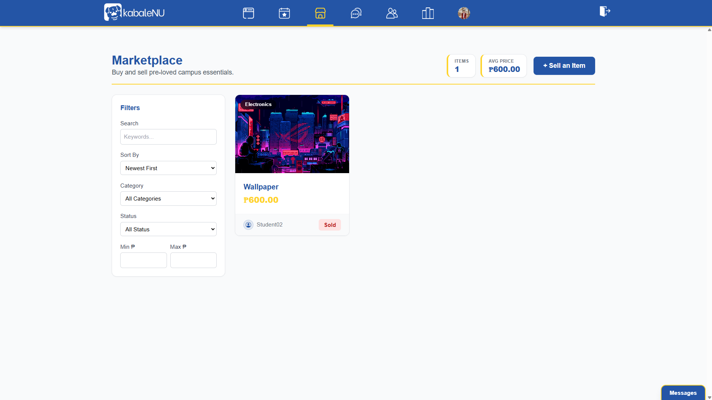

### Channels
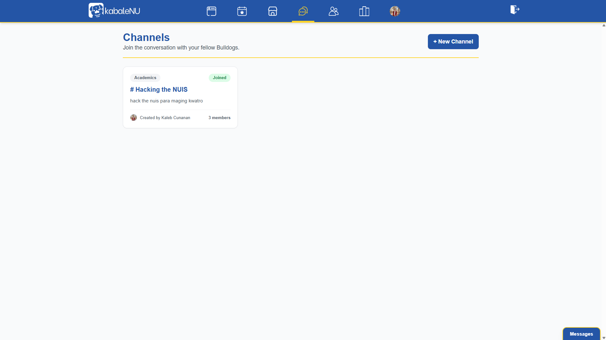

### Friends
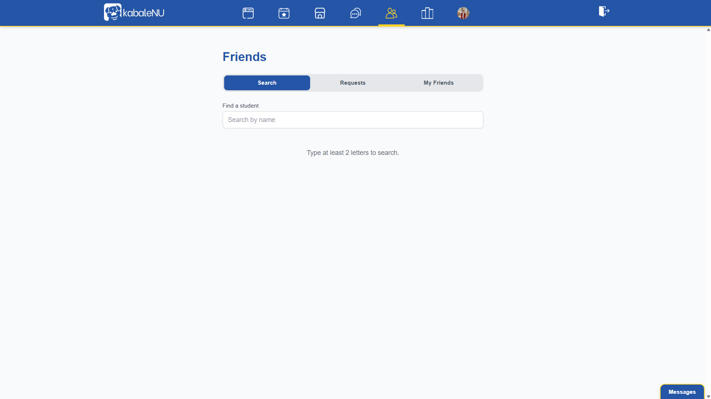

### Leaderboard
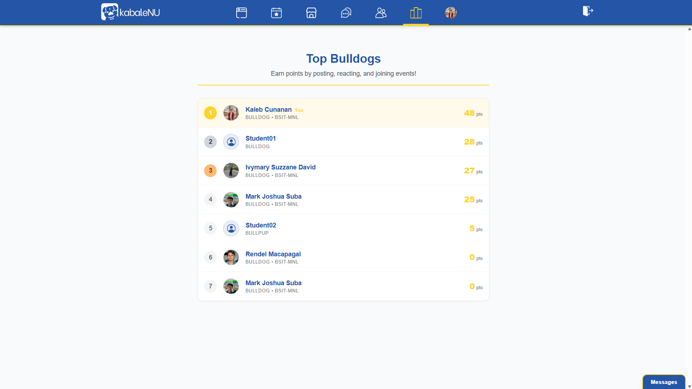

### Mobile (375px)
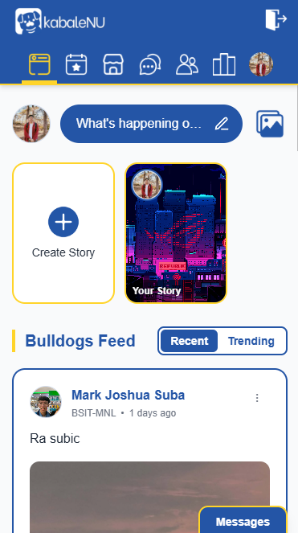

## Setup

Requirements: Node.js, a MongoDB Atlas cluster, and a Cloudinary account.

```bash
git clone <repository-url>
cd KabaleNU-campus-connect
```

### Server

```bash
cd server
npm install
cp .env.example .env   # then fill in the values below
npm run seed           # optional: load sample data (see the warning below)
npm run dev            # http://localhost:5000
```

| Variable | Purpose |
| -------- | ------- |
| `PORT` | Server port (default 5000) |
| `MONGO_URI` | MongoDB Atlas connection string (required) |
| `JWT_SECRET` | Secret used to sign the session token (required) |
| `JWT_EXPIRES_IN` | Token lifetime, for example `7d` |
| `CLIENT_URL` | Allowed CORS origin (default `http://localhost:5173`) |
| `NODE_ENV` | `development` or `production` (production blocks the seed script) |
| `CLOUDINARY_CLOUD_NAME` | Cloudinary account name |
| `CLOUDINARY_API_KEY` | Cloudinary API key |
| `CLOUDINARY_API_SECRET` | Cloudinary API secret |

Warning: `npm run seed` deletes every document in the User, Post, Comment, Reaction, Event, Registration, MarketItem, Channel, Message, and Conversation collections before loading the sample data. It refuses to run when `NODE_ENV=production`, so back up any data you want to keep first.

If you are updating an existing database, run `node utils/syncIndexes.js` once from the `server` folder so the new partial indexes on `Conversation` replace the old unique index.

### Client

```bash
cd client
npm install
cp .env.example .env   # optional
npm run dev            # http://localhost:5173
```

| Variable | Purpose |
| -------- | ------- |
| `VITE_API_URL` | API base URL (default `http://localhost:5000/api`) |

### Demo accounts

The seed script creates one faculty account, `admin@nu-clark.edu.ph`, and several Bulldog and Bullpup accounts. All seeded accounts use the password `password123`. The seed does not create stories or friendships, and seeded channels start with no members, so join them before chatting.

## API Documentation

62 endpoints across 10 routers. All errors return JSON in the form `{ "message": "..." }`. Status codes: 200 success, 201 created, 400 validation or business-rule error, 401 not logged in, 403 wrong role, not the owner, or not a member or friend, 404 not found, 500 server error.

Endpoints that take files use `multipart/form-data`. Photos are limited to 10 MB (avatars, banners, and marketplace photos 5 MB) and videos to 50 MB. The same routes also answer without the `/api` prefix for Vercel.

### Users and Auth (`/api/users`)

| Method | Path | Purpose | Auth |
| ------ | ---- | ------- | ---- |
| POST | `/api/users/register` | Create an account (multipart, optional `profilePicture`) and set the session cookie | Public |
| POST | `/api/users/login` | Log in and set the session cookie | Public |
| POST | `/api/users/logout` | Clear the session cookie | Required |
| GET | `/api/users/me` | Return the logged-in user | Required |
| GET | `/api/users/me/registrations` | Return all events the user is attending | Required |
| GET | `/api/users/leaderboard` | Return the Top 10 students by Bulldog Score (processing) | Required |
| GET | `/api/users` | List all users | Faculty only |
| GET | `/api/users/:id` | Get a user profile (full record for yourself or faculty, public fields otherwise) | Required |
| PUT | `/api/users/:id` | Update name, email, program, or profile picture (multipart) | Self or faculty |
| DELETE | `/api/users/:id` | Delete a user and everything they own | Faculty only |

Sample login request:

```json
{ "email": "admin@nu-clark.edu.ph", "password": "password123" }
```

Sample login response (200):

```json
{
  "_id": "6702f1c2a1b2c3d4e5f60718",
  "name": "Prof. Faculty",
  "email": "admin@nu-clark.edu.ph",
  "role": "faculty",
  "profilePicture": "",
  "bulldogScore": 0
}
```

Sample leaderboard response (200):

```json
[
  { "_id": "6702f1c2a1b2c3d4e5f60719", "name": "Kaleb Cunanan", "role": "bulldog", "program": "BSIT-MNL", "bulldogScore": 48, "rank": 1 }
]
```

### Posts and Moderation (`/api/posts`, `/api/comments`)

| Method | Path | Purpose | Auth |
| ------ | ---- | ------- | ---- |
| GET | `/api/posts` | Get active posts, newest first (`?author=<id>` returns one user's posts, friends only) | Required |
| GET | `/api/posts/trending` | Get posts sorted by Hotness Score (processing) | Required |
| POST | `/api/posts` | Create a post (multipart: `content` and up to 4 `media` files, +5 Bulldog Score) | Required |
| GET | `/api/posts/:id` | Get one active post | Required |
| PUT | `/api/posts/:id` | Edit the content of your own post | Author only |
| DELETE | `/api/posts/:id` | Delete a post with its comments, reactions, and media | Author or faculty |
| POST | `/api/posts/:id/react` | Toggle a Bulldog React on or off | Required |
| POST | `/api/posts/:id/report` | Report a post, hidden after 5 reports (processing) | Required |
| GET | `/api/posts/:id/comments` | Get the comments of a post, newest first | Required |
| POST | `/api/posts/:id/comments` | Add a comment to a post | Required |
| DELETE | `/api/comments/:id` | Delete a comment | Author or faculty |

Sample react response (200):

```json
{ "message": "Reaction added", "hasReacted": true }
```

Sample report success: `POST /api/posts/:id/report` returns 200 with a `message`; the post is hidden once the fifth user reports it.

Sample report error (400):

```json
{ "message": "You have already reported this post" }
```

### Stories (`/api/stories`)

| Method | Path | Purpose | Auth |
| ------ | ---- | ------- | ---- |
| GET | `/api/stories` | Get active stories grouped per author and purge expired ones | Required |
| POST | `/api/stories` | Create a story (multipart: one `media` file and optional `caption`) | Required |
| DELETE | `/api/stories/:id` | Delete a story and its media | Author or faculty |

### Events (`/api/events`)

| Method | Path | Purpose | Auth |
| ------ | ---- | ------- | ---- |
| GET | `/api/events` | Get all campus events | Required |
| POST | `/api/events` | Create an event (multipart, optional `banner`) | Faculty only |
| GET | `/api/events/:id` | Get one event | Required |
| PUT | `/api/events/:id` | Update an event | Organizer only |
| DELETE | `/api/events/:id` | Delete an event with its registrations and banner | Organizer only |
| GET | `/api/events/:id/registrations` | List the registered students of an event | Faculty only |
| POST | `/api/events/:id/register` | Register for an event, checks slots and time conflicts (processing) | Required |
| DELETE | `/api/events/:id/register` | Cancel your registration | Required |

Sample register response (201):

```json
{
  "_id": "6702f1c2a1b2c3d4e5f60730",
  "user": "6702f1c2a1b2c3d4e5f60719",
  "event": "6702f1c2a1b2c3d4e5f60725",
  "status": "registered"
}
```

Sample register error (400):

```json
{ "message": "Time conflict with another registered event" }
```

### Marketplace (`/api/market`)

| Method | Path | Purpose | Auth |
| ------ | ---- | ------- | ---- |
| GET | `/api/market` | Get all items | Required |
| GET | `/api/market/search` | Search with filters and calculate the average price (processing) | Required |
| GET | `/api/market/:id` | Get one item | Required |
| POST | `/api/market` | Post an item for sale (multipart: `title`, `price`, `category`, `image`) | Required |
| PUT | `/api/market/:id` | Update an item, optionally with a new photo | Seller only |
| PUT | `/api/market/:id/status` | Move an item through Available, Reserved, and Sold (processing) | Seller only |
| DELETE | `/api/market/:id` | Delete an item and its photo | Seller or faculty |

Sample search request: `GET /api/market/search?category=School%20Materials&status=Available&maxPrice=500`

Sample search response (200):

```json
{
  "count": 1,
  "averagePrice": 350,
  "lowestPrice": 350,
  "highestPrice": 350,
  "items": [{ "_id": "6702f1c2a1b2c3d4e5f60720", "title": "Data Structures Book", "price": 350, "category": "School Materials", "status": "Available" }]
}
```

Sample status request body, success (200 returns the updated item), and error (400):

```json
{ "status": "Available" }
```

```json
{ "message": "Invalid status transition from Sold to Available" }
```

### Channels (`/api/channels`, `/api/messages`)

| Method | Path | Purpose | Auth |
| ------ | ---- | ------- | ---- |
| GET | `/api/channels` | Get all channels with member counts | Required |
| POST | `/api/channels` | Create a channel (the creator joins automatically) | Required |
| GET | `/api/channels/:id` | Get one channel | Required |
| DELETE | `/api/channels/:id` | Delete a channel with its messages | Creator only |
| POST | `/api/channels/:id/join` | Join a channel | Required |
| POST | `/api/channels/:id/leave` | Leave a channel (the creator cannot leave) | Member |
| GET | `/api/channels/:id/messages` | Get the newest messages, oldest first (`?limit=`, default 50) | Member |
| POST | `/api/channels/:id/messages` | Send a message to a channel | Member |
| DELETE | `/api/messages/:id` | Delete a message | Sender or faculty |

### Friends (`/api/friends`)

| Method | Path | Purpose | Auth |
| ------ | ---- | ------- | ---- |
| GET | `/api/friends/search` | Search students by name (`?q=`, at least 2 characters) | Required |
| GET | `/api/friends/requests/count` | Count incoming pending requests | Required |
| GET | `/api/friends/requests` | List incoming pending requests | Required |
| GET | `/api/friends/status/:userId` | Get the friendship status with a user | Required |
| POST | `/api/friends/requests/:userId` | Send a friend request | Required |
| PUT | `/api/friends/requests/:id/accept` | Accept a request | Recipient only |
| DELETE | `/api/friends/requests/:id` | Decline or cancel a pending request | Recipient or requester |
| GET | `/api/friends` | List your friends | Required |
| DELETE | `/api/friends/:userId` | Unfriend a user | Required |

### Direct Messages (`/api/conversations`)

| Method | Path | Purpose | Auth |
| ------ | ---- | ------- | ---- |
| GET | `/api/conversations` | List your conversations that have messages | Required |
| POST | `/api/conversations` | Start a chat with a seller about an item (`{ "itemId": "..." }`) | Required |
| POST | `/api/conversations/direct` | Start a chat with a friend (`{ "friendId": "..." }`) | Friends only |
| GET | `/api/conversations/:id/messages` | Get the messages of a conversation | Participant |
| POST | `/api/conversations/:id/messages` | Send a message | Participant |

## Project Documentation

| File | Contents |
| ---- | -------- |
| `prd.md` | Product requirements, user flows, and the demo checklist |
| `schema.md` | The 12 collections, relationships, and all 62 endpoints |
| `architecture-trd.md` | File-by-file technical reference for the client and the server |
| `rules.md` | Coding rules the team follows |

## Known Limitations

- Channels and direct messages refresh by polling (3 to 8 seconds) instead of WebSockets, so a message can take a few seconds to appear. There are no unread badges.
- Direct messages are text only, and messages cannot be edited or deleted from the UI.
- The leaderboard shows only the top 10 students, and channel rooms show only the newest 50 messages.
- The profile page can change only the profile picture; name, email, and program cannot be edited yet.
- Marketplace items and posts cannot be edited from the UI, even though the API supports it.
- Only the creator can delete a channel (faculty cannot), and the creator cannot leave their own channel.
- Friend profile links currently appear only on post authors, not on comments, stories, the leaderboard, or channel messages.
- The Friends badge refreshes every 10 seconds, so a new request can take a moment to show.
- Faculty accounts cannot register for events, and an event that is full or overlaps another registration returns a 400 error shown inline on the event card.
- Posts with the same Hotness Score have no guaranteed order in the Trending tab.
- The navbar is designed for 360px screens and wider; it would overflow below that.
- The seed script does not create stories or friendships, and the seeded marketplace images are placeholder URLs.
